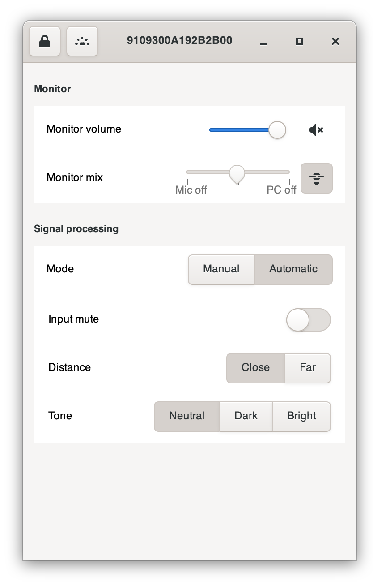
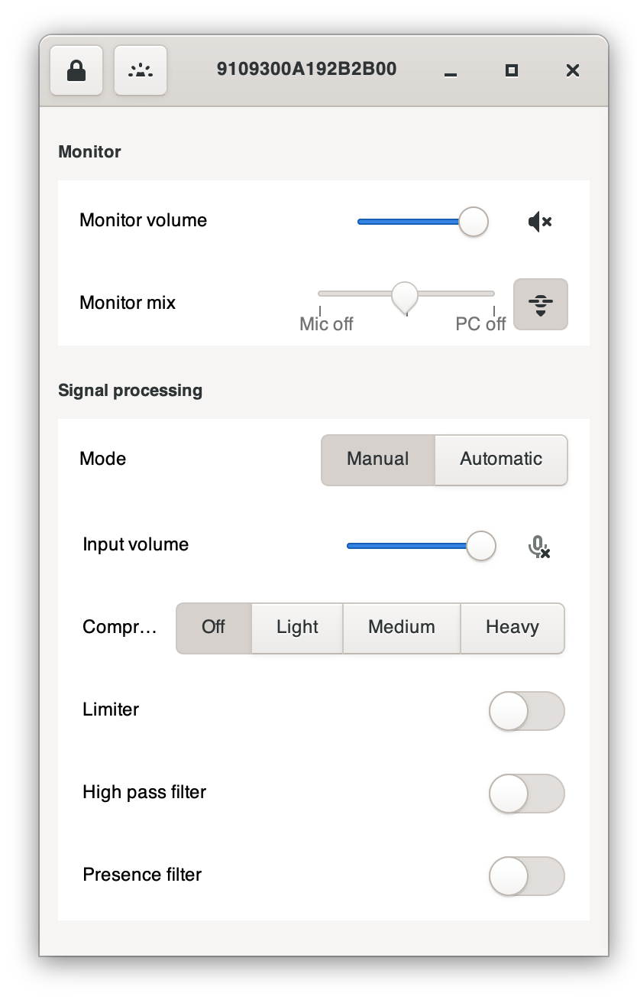

# mv7config

Unofficial utility for configuring SHURE MV7 microphones for Linux and macOS.


## Linux


How to start the App

```bash
% cd <WHERE-YOU-DOWNLOADED>
% python3.11 ./gui.py
```

## macOS

How to start the App

```bash
% cd <WHERE-YOU-DOWNLOADED>
% python3.11 ./gui.py
```

### automatic setup


## manual setup



### Installation macOS

1. Install Cython (C to Python)
```
% git clone --recursive https://github.com/trezor/cython-hidapi.git
% cd cython-hidapi
% python3.11 setup.py build
% sudo python3.11 setup.py install
% pip install -e .
```

2. Install hidapi and hid

```
% brew install hidapi
```

```
% pip install hid
```


3. Install macOS native drivers

https://github.com/libusb/hidapi/blob/master/BUILD.md#mac

https://github.com/libusb/hidapi/blob/master/BUILD.md#mac

```bash
% mkdir build
% cd build
% cmake ..
% make
[ 50%] Building C object src/mac/CMakeFiles/hidapi_darwin.dir/hid.c.o
[100%] Linking C shared library libhidapi.dylib
[100%] Built target hidapi_darwin

% make install
[100%] Built target hidapi_darwin
Install the project...
-- Install configuration: "Release"
-- Installing: /usr/local/lib/libhidapi.0.15.0.dylib
-- Installing: /usr/local/lib/libhidapi.0.dylib
-- Installing: /usr/local/lib/libhidapi.dylib
-- Installing: /usr/local/include/hidapi/hidapi.h
-- Installing: /usr/local/include/hidapi/hidapi_darwin.h
-- Installing: /usr/local/lib/pkgconfig/hidapi.pc
-- Old export file "/usr/local/lib/cmake/hidapi/libhidapi.cmake" will be replaced.  Removing files [/usr/local/lib/cmake/hidapi/libhidapi-release.cmake].
-- Installing: /usr/local/lib/cmake/hidapi/libhidapi.cmake
-- Installing: /usr/local/lib/cmake/hidapi/libhidapi-release.cmake
-- Installing: /usr/local/lib/cmake/hidapi/hidapi-config-version.cmake
-- Installing: /usr/local/lib/cmake/hidapi/hidapi-config.cmake
```


4. Test your Python HID installation

```
% python3.11
>>> import hid
>>> hid.version
(0, 15, 0)
```

If you can load hid then hid is installed on Python.


### mv7config

```
% python3.11 ./repl.py
No MV7 microphone found
```

Plug in microphone.

```
% python3.11 ./repl.py
> help
audioMute      micMute        volume         inputGain
fwVersion      serialNum      dspMode        dspVersion
bootDSP        getSampleRate  getBlock       setBlock
pkgVersion     lock           myCID          dimMode
meterMode      rateMismatch   deviceType     interfaceId
identify       getSN          getSAPSN       

> fwVersion
fwVersion=0.0.49.0

> dspVersion

dspVersion=0.0.5.22

> pkgVersion

pkgVersion=1.2.17 

> interfaceId

interfaceId=0.3.0

> identify

OK

```

Hit CONTROL+C to exit.


### FAQ


Q: Does it support the full spec of this mic?

A: Yes, it does.


Q: Does this really works and is it stable?

A: Yes, and yes! It works and it is stable.


Q: Does SHURE VM7+ works? (SHURE VM7 plus)

A: It should, but not tested. Maybe it has an other USB product ID, then the app must be changed.


Q: app does not start, microphone does not work, etc.

A: Just un-plug the USB-Calbe for about 10 seconds. Plug the USB-Calbe in again, wait again about 10 seconds after the microphone has completely booted (LEDs will stop blinking), then try again.


### FAQ technical details (communication protocoll)

Q: Is there a secret menu in the microphone?

A: Yes there is, it's "su adm" switch user to admin.


Q: How does it work?

A: The SHURE VM7 and SHURE VM7 plus are smart microphones, that means you can etup this devices.
It works by connecting to the USB port via HID (Human Interface Device) protocoll, then a 64 byte long command as a string can be sent to the device, then the device will answer with a 64 byte long string. So it goes back and forth, you can turn microphone mute on and off, etc. with simply send some human readable command as text characters.


Q: What is the initial startup procedure of this app?

A: Note that the command sent to the mic and the answer from the mic is below later.

For example "fwVersion" then after a few other commands the answer shows up "fwVersion=0.0.49.0".


```bash
% python3.11 ./gui.py
[   DEBUG] mv7config.text_hid: ( IN DevSrvsID:4295065059) su=adm            // switch user to admin, allow more commands
[   DEBUG] mv7config.text_hid: (OUT DevSrvsID:4295065059) bootDSP C         // boot DSP digital sound port
[   DEBUG] mv7config.text_hid: ( IN DevSrvsID:4295065059) dspBooted         // DSP booted, and ready
[   DEBUG] mv7config.text_hid: (OUT DevSrvsID:4295065059) dspMode           // 
[   DEBUG] mv7config.text_hid: ( IN DevSrvsID:4295065059) dspMode=1
[   DEBUG] mv7config.text_hid: (OUT DevSrvsID:4295065059) getBlock 1F
[   DEBUG] mv7config.text_hid: (OUT DevSrvsID:4295065059) fwVersion         // firmware version
[   DEBUG] mv7config.text_hid: (OUT DevSrvsID:4295065059) getBlock 22
[   DEBUG] mv7config.text_hid: (OUT DevSrvsID:4295065059) volume
[   DEBUG] mv7config.text_hid: (OUT DevSrvsID:4295065059) getBlock 34
[   DEBUG] mv7config.text_hid: (OUT DevSrvsID:4295065059) pkgVersion
[   DEBUG] mv7config.text_hid: (OUT DevSrvsID:4295065059) lock
[   DEBUG] mv7config.text_hid: (OUT DevSrvsID:4295065059) audioMute
[   DEBUG] mv7config.text_hid: (OUT DevSrvsID:4295065059) getBlock 19
[   DEBUG] mv7config.text_hid: (OUT DevSrvsID:4295065059) getBlock 31
[   DEBUG] mv7config.text_hid: (OUT DevSrvsID:4295065059) dspVersion
[   DEBUG] mv7config.text_hid: (OUT DevSrvsID:4295065059) micMute
[   DEBUG] mv7config.text_hid: (OUT DevSrvsID:4295065059) serialNum
[   DEBUG] mv7config.text_hid: (OUT DevSrvsID:4295065059) inputGain
[   DEBUG] mv7config.text_hid: ( IN DevSrvsID:4295065059) block 1F 00000000
[   DEBUG] mv7config.text_hid: ( IN DevSrvsID:4295065059) fwVersion=0.0.49.0     // firmware version
[   DEBUG] mv7config.text_hid: ( IN DevSrvsID:4295065059) block 34 00000000
[   DEBUG] mv7config.text_hid: ( IN DevSrvsID:4295065059) pkgVersion=1.2.17
[   DEBUG] mv7config.text_hid: (OUT DevSrvsID:4295065059) getBlock 22
[   DEBUG] mv7config.text_hid: (OUT DevSrvsID:4295065059) volume
[   DEBUG] mv7config.text_hid: (OUT DevSrvsID:4295065059) lock
[   DEBUG] mv7config.text_hid: (OUT DevSrvsID:4295065059) getBlock 31
[   DEBUG] mv7config.text_hid: (OUT DevSrvsID:4295065059) audioMute
[   DEBUG] mv7config.text_hid: (OUT DevSrvsID:4295065059) getBlock 19
[   DEBUG] mv7config.text_hid: (OUT DevSrvsID:4295065059) dspVersion
[   DEBUG] mv7config.text_hid: (OUT DevSrvsID:4295065059) micMute
[   DEBUG] mv7config.text_hid: (OUT DevSrvsID:4295065059) serialNum
[   DEBUG] mv7config.text_hid: (OUT DevSrvsID:4295065059) inputGain
[   DEBUG] mv7config.text_hid: ( IN DevSrvsID:4295065059) block 22 002026F3004026E7
[   DEBUG] mv7config.text_hid: ( IN DevSrvsID:4295065059) volume=-2dB
[   DEBUG] mv7config.text_hid: ( IN DevSrvsID:4295065059) dspVersion=0.0.5.22
[   DEBUG] mv7config.text_hid: ( IN DevSrvsID:4295065059) micMute=off
[   DEBUG] mv7config.text_hid: ( IN DevSrvsID:4295065059) serialNum=9109300A192B2B00
[   DEBUG] mv7config.text_hid: ( IN DevSrvsID:4295065059) inputGain=36dB
[   DEBUG] mv7config.text_hid: (OUT DevSrvsID:4295065059) lock
[   DEBUG] mv7config.text_hid: (OUT DevSrvsID:4295065059) audioMute
[   DEBUG] mv7config.text_hid: (OUT DevSrvsID:4295065059) getBlock 19
[   DEBUG] mv7config.text_hid: (OUT DevSrvsID:4295065059) getBlock 31
[   DEBUG] mv7config.text_hid: ( IN DevSrvsID:4295065059) lock=off            // lock off
[   DEBUG] mv7config.text_hid: ( IN DevSrvsID:4295065059) audioMute=off       // mute off
[   DEBUG] mv7config.text_hid: ( IN DevSrvsID:4295065059) block 19 00000000
[   DEBUG] mv7config.text_hid: ( IN DevSrvsID:4295065059) block 31 00000000
```


```
identify         // LEDs blinking
OK


su adm          // switch to user admin
su=adm\n


bootDSP C           // Boot to DSP (Digital Sound Protocoll ?)
dspBooted\n


micMute on       // mute mic


micMute off      // unmute mic


inputGain ...


// compressor
setBlock 19 ...


// limiter
setBlock 1F ...


// lock user inputs
lock on


// unlock user inputs
lock off


audioMute on        // mute audio


audioMute off      // unmute audio


volume ...        // set volume to


setBlock 22

```


### Technical issues problems and solutions

Problem:

```
ValueError: Namespace Handy not available
```

Solution:

```
% brew install libhandy
```


